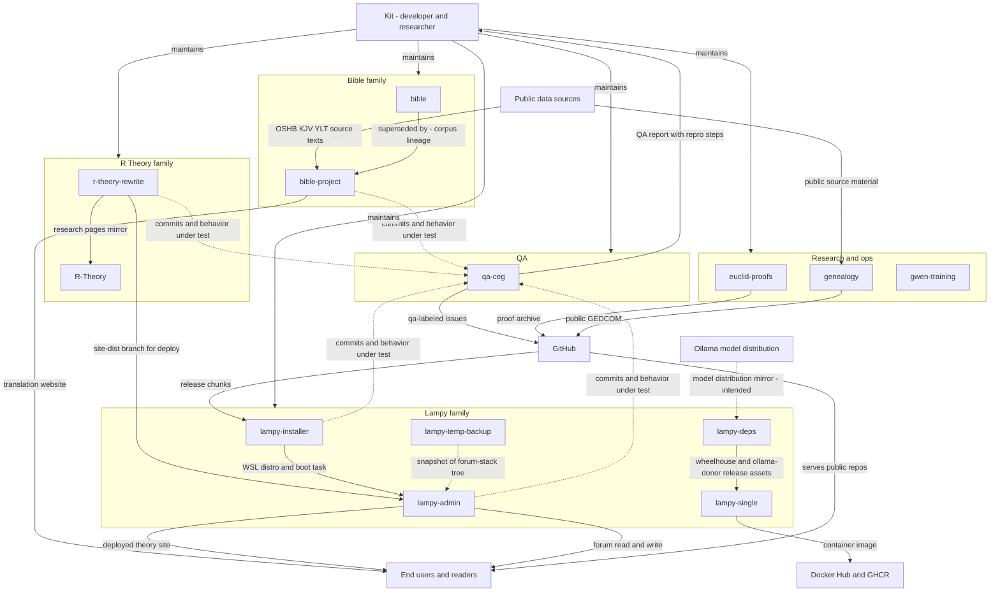
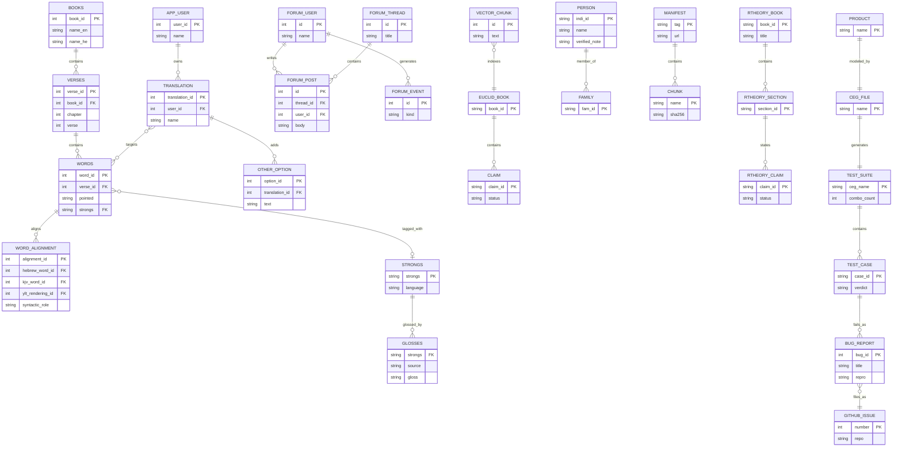

Living document — update these diagrams when adding features.

# cosbykit-afk — System-wide architecture

Profile-level view of the 13-repo ecosystem: how the repositories relate to each other
and to the outside world, and where the system's data actually lives.

Repo families: **Bible** (bible, bible-project), **R Theory** (r-theory-rewrite, R-Theory),
**Lampy** (lampy-installer, lampy-admin, lampy-single, lampy-deps, lampy-temp-backup),
**QA** (qa-ceg), **Research and ops** (euclid-proofs, genealogy, gwen-training).

## 1. System-wide context diagram

The 13 repositories as subsystems, with external entities and the data flows between them.
Dotted flows are intended or not-directly-observed links (see Grounding notes).

## 2. Systemwide database documentation

### 2a. Data store inventory

| Store | Owning repo(s) | Key entities | Notes |
|---|---|---|---|
| bible.db (SQLite, read-only) | bible | 11 corpus tables, 264217 words | Frozen v1 corpus; superseded by bible-project |
| bible_v2.db (SQLite, read-only) | bible-project | 24 normalized tables, 264217 words | v2 schema: books, verses, words, strongs (+components, sources), morph patterns/segments, root tiers, lexicon + 4 child tables, glosses, kjv_words, kjv_renderings, ylt_verses, ylt_renderings, word_alignment, word_variants, morph_variants. Live website still serves v1 pending Kit's schema review |
| Derived alignment/variant rows | bible-project | word_alignment ~836k rows, word_variants ~528k rows, morph_variants 28 rows | Derived-data stage output; never alters base tables |
| app.db (SQLite) | bible-project website | app_user, translation, other_option | Website writes; corpus stays read-only |
| user_data choice files | bible-project website | one byte per word choices | Per-user translation decisions; byte offset = word_id - 1 |
| Forum database | lampy-admin (forum app) | users, categories, threads, posts, forum_events, docs, forum_daily, mail_user_roles | Console borrows forum users table for auth |
| Euclid vectors SQLite | euclid-proofs | 606 Elements chunks, FTS5 index | Embedded via Ollama for lookup |
| Claim ledger files | euclid-proofs | 493 proved, 79 checked, 209 asserted, 32 incomplete | Per-book claim files under trig_proof |
| Public GEDCOM | genealogy | persons, families | Verified-only copy; private working file not published |
| Change ledger | genealogy | applied research proposals | Two-track admission rulebook in verified/VERIFIED.md |
| Installer manifest | lampy-installer | manifest.json, 7 signed chunks, install log | No persistent runtime data model |
| Document tree | r-theory-rewrite | books, sections, figures, claims | Static site source; structure modeled, no database |
| Research mirror files | R-Theory | 3 HTML pages, 6 CSV/JSON tables | Backup mirror of r-theory-rewrite research pages |
| Build context | lampy-single | Dockerfile, supervisord conf, forum source | Produces container image; no runtime data |
| Dependency release assets | lampy-deps | build-deps-v1 release: 7 assets (~7.8 GiB) | wheelhouse.tar.part00-02 + ollama-donor.tar.part00-03; git tree holds only README + docs |
| Code snapshot | lampy-temp-backup | 134-entry working tree plus tarball | Static backup, verified 2026-09-21 |
| Curriculum docs | gwen-training | lesson plan, lessons, prompts | No persistent data model |
| CEG model files | qa-ceg | ceg/*.ceg graphs: inputs, effects, requirements | One graph per product: r-theory-rewrite, forum, lampy-installer, bible-project, profile |
| Generated test suites | qa-ceg | suites/*.tests.md (published), *.tests.json (private) | ceg.py enumerates all combos; exit code = uncovered requirement count |
| Bug database and ledger | qa-ceg | bugs.db (private), PRIVATE_LEDGER.md (private export) | Two-way sync with GitHub qa-labeled issues |

### 2b. Cross-system entity relationships

Key entities per database and how they relate within and across systems.

The bible-project corpus entities above are schema-exact (v2, `schema_v2.sql`).
Remaining entities are representative except where a repo draft documents them
(bible-project website tables, forum tables, genealogy GEDCOM entities,
qa-ceg model entities).

Cross-database links (by design, not by foreign key):
- `TRANSLATION.targets -> WORDS`: the bible-project website writes user
  translations against the read-only corpus. Corpus (`bible_v2.db`) and
  website data (`app.db`) are separate SQLite files by design; choice files
  index by `word_id` at byte offset `word_id - 1`.
- `bible.bible.db -> bible-project.bible_v2.db`: lineage only. The bible copy
  is the frozen v1 corpus and superseded; bible-project rebuilt it, extended
  it (U-8/U-9 repairs, YLT alignment, Flask website), and normalized it to
  the v2 schema. The v1 `bible.db` is retained as a frozen baseline; the live
  website still serves v1 — v2 cutover awaits Kit's schema review.
- `FORUM_USER` is shared: lampy-admin's console authenticates against the
  forum's users table rather than keeping its own account store.
- `r-theory-rewrite -> lampy-admin`: the console pulls the site-dist branch and
  deploys the static theory site; no shared database involved.
- `qa-ceg -> GitHub issues`: the QA system files `qa`-labeled bug reports on
  r-theory-rewrite, lampy-installer, bible-project, and qa-ceg itself
  (forum/profile are ledger-only, no repo); a private `bugs.db` stays synced
  two-way with GitHub.

## Grounding notes

- OBSERVED: every repo's purpose, file tree, and README-derived flows come from
  the per-repo drafts in ~/workspace/sad-docs/drafts/, each researched via the
  GitHub API (README + recursive tree + key files).
- OBSERVED: installer release chunks from GitHub; installer creates the WSL
  distro that lampy-admin runs inside; admin pulls r-theory-rewrite site-dist;
  R-Theory is a declared backup mirror of r-theory-rewrite research pages;
  bible is declared superseded by bible-project.
- OBSERVED (2026-09-28): lampy-deps now carries the `build-deps-v1` release
  (7 assets, ~7.8 GiB: wheelhouse.tar.part00-02 + ollama-donor.tar.part00-03,
  created 2026-09-27) that supplies the lampy-single build — the
  deps→single flow is drawn solid. The Ollama distribution→deps mirror flow
  remains INFERRED (wheels/binaries reached the release via staging scripts,
  not a direct upstream transfer); no files are committed to the lampy-deps
  git tree itself (README + docs only).
- INFERRED: the tempbackup -> admin restore direction. The repo is a verified
  snapshot of the forum-stack tree; no restore procedure was observed.
- INFERRED: exact table and key names in the systemwide ERD are representative,
  not schema-exact, except where a repo draft documents them (bible-project
  corpus and website tables, forum tables, genealogy GEDCOM entities, qa-ceg
  model entities). See each repo's Grounding notes for the precise level of
  certainty.
- OBSERVED: `qa-ceg` (created 2026-09-28) is the 14th repository and a new QA
  family. Its repo tree (16 files), README, `ceg/profile.ceg` format, and
  `qa_daily.py` phases (detect → regen → test → issues → sync) were read via
  the GitHub API; measured suite sizes (bible-project v2: 13,824 combos;
  lampy-installer: 2,880 combos) are 2026-09-28 recorded results.
- OBSERVED: bible-project v2 normalization (`schema_v2.sql`, 24 tables,
  `schema_v2.md`): migration verification 2026-09-28 — 66.9 s over 264,217
  words, 0 FK violations, lexicon round-trips 0 mismatches on 126,869 rows;
  `app_v2.py` staged on the laptop behind `/bible-v2` (port 5058), live
  `/bible` still serves v1 — NO live cutover; Kit's schema review pending.
- OMITTED deliberately: the Facebook R Theory group, Tailscale, and Toetop host
  details are deployment/operations context, not repository architecture, and
  were not observed in the repos themselves.
