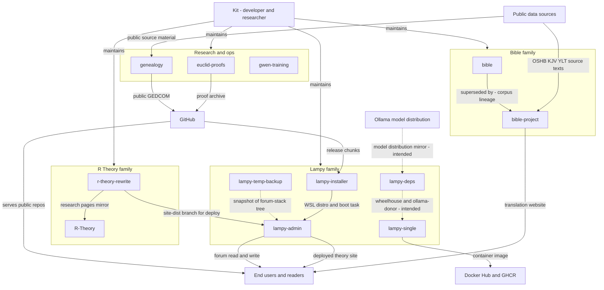
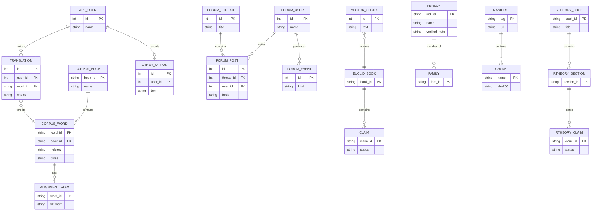

Living document — update these diagrams when adding features.

# cosbykit-afk — System-wide architecture

Profile-level view of the 12-repo ecosystem: how the repositories relate to each other
and to the outside world, and where the system's data actually lives.

Repo families: **Bible** (bible, bible-project), **R Theory** (r-theory-rewrite, R-Theory),
**Lampy** (lampy-installer, lampy-admin, lampy-single, lampy-deps, lampy-temp-backup),
**Research and ops** (euclid-proofs, genealogy, gwen-training).

## 1. System-wide context diagram

The 12 repositories as subsystems, with external entities and the data flows between them.
Dotted flows are intended or not-directly-observed links (see Grounding notes).

## 2. Systemwide database documentation

### 2a. Data store inventory

| Store | Owning repo(s) | Key entities | Notes |
|---|---|---|---|
| bible.db (SQLite, read-only) | bible, bible-project | 11 corpus tables, 264217 words | Built by batch pipeline; bible copy frozen, bible-project copy live |
| YLT alignment rows | bible-project | 337601 computed alignment rows | Repair and alignment stage output |
| app.db (SQLite) | bible-project website | app_user, translation, other_option | Website writes; corpus stays read-only |
| user_data choice files | bible-project website | one byte per word choices | Per-user translation decisions |
| Forum database | lampy-admin (forum app) | users, categories, threads, posts, forum_events, docs, forum_daily, mail_user_roles | Console borrows forum users table for auth |
| Euclid vectors SQLite | euclid-proofs | 606 Elements chunks, FTS5 index | Embedded via Ollama for lookup |
| Claim ledger files | euclid-proofs | 493 proved, 79 checked, 209 asserted, 32 incomplete | Per-book claim files under trig_proof |
| Public GEDCOM | genealogy | persons, families | Verified-only copy; private working file not published |
| Change ledger | genealogy | applied research proposals | Two-track admission rulebook in verified/VERIFIED.md |
| Installer manifest | lampy-installer | manifest.json, 7 signed chunks, install log | No persistent runtime data model |
| Document tree | r-theory-rewrite | books, sections, figures, claims | Static site source; structure modeled, no database |
| Research mirror files | R-Theory | 3 HTML pages, 6 CSV/JSON tables | Backup mirror of r-theory-rewrite research pages |
| Build context | lampy-single | Dockerfile, supervisord conf, forum source | Produces container image; no runtime data |
| Code snapshot | lampy-temp-backup | 134-entry working tree plus tarball | Static backup, verified 2026-09-21 |
| Curriculum docs | gwen-training | lesson plan, lessons, prompts | No persistent data model |

### 2b. Cross-system entity relationships

Key entities per database and how they relate within and across systems.

Cross-database links (by design, not by foreign key):
- `TRANSLATION.targets -> CORPUS_WORD`: the bible-project website writes user
  translations against the read-only corpus. Corpus and website data are separate
  SQLite files by design.
- `bible.bible.db -> bible-project.bible.db`: lineage only. The bible copy is
  frozen and superseded; bible-project rebuilt and extended the corpus.
- `FORUM_USER` is shared: lampy-admin's console authenticates against the
  forum's users table rather than keeping its own account store.
- `r-theory-rewrite -> lampy-admin`: the console pulls the site-dist branch and
  deploys the static theory site; no shared database involved.

## Grounding notes

- OBSERVED: every repo's purpose, file tree, and README-derived flows come from
  the per-repo drafts in ~/workspace/sad-docs/drafts/, each researched via the
  GitHub API (README + recursive tree + key files).
- OBSERVED: installer release chunks from GitHub; installer creates the WSL
  distro that lampy-admin runs inside; admin pulls r-theory-rewrite site-dist;
  R-Theory is a declared backup mirror of r-theory-rewrite research pages;
  bible is declared superseded by bible-project.
- INFERRED: the lampy-deps -> lampy-single supply flow and the Ollama
  distribution -> lampy-deps mirror flow are the README's stated intent; no
  files have ever been committed to lampy-deps, so both are drawn dotted.
- INFERRED: the tempbackup -> admin restore direction. The repo is a verified
  snapshot of the forum-stack tree; no restore procedure was observed.
- INFERRED: exact table and key names in the systemwide ERD are representative,
  not schema-exact, except where a repo draft documents them (bible-project
  website tables, forum tables, genealogy GEDCOM entities). See each repo's
  Grounding notes for the precise level of certainty.
- OMITTED deliberately: the Facebook R Theory group, Tailscale, and Toetop host
  details are deployment/operations context, not repository architecture, and
  were not observed in the repos themselves.
